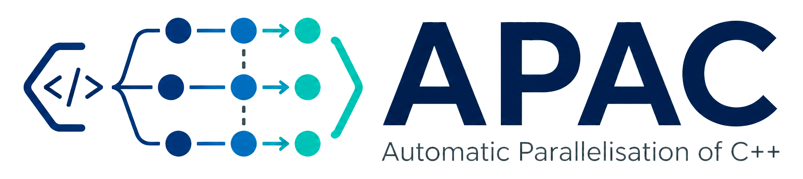

<div align="center">
  

  **Automatic Parallelisation of C++ using OpenMP task dependencies**

  Source-to-source compiler built on LLVM/Clang 18

  [](LICENSE)
  [](https://isocpp.org/)
  [](https://llvm.org/)
  [](https://www.openmp.org/)

</div>

---

## Overview

**APAC** is a source-to-source compiler that automatically transforms sequential C++ programs into parallel code using OpenMP task dependencies.

Given a plain C++ source file, APAC analyses data dependencies between statements and rewrites the source with `#pragma omp task depend(...)` directives so that the output can exploit multiple processor cores without requiring manual annotations.

APAC is built on **LLVM/Clang 18** and implements its analysis as a pipeline of composable transformation passes.

---

## Statement of Need

Writing correct parallel code with OpenMP task dependencies requires identifying every data dependence between statements and annotating every task with correct `depend(in: ...)`, `depend(out: ...)`, or `depend(inout: ...)` clauses.

Missing or incorrect annotations can produce hard-to-reproduce data races.

APAC automates this annotation process for pointer-based and recursive C++ programs, targeting scientific computing codes that fall outside the affine loop model assumed by polyhedral compilers.

---

## Key Features

- **Fully automatic**  
  No source annotations are required on the input.

- **Source-to-source compilation**  
  The output is readable C++17 code with OpenMP directives.

- **OpenMP task dependencies**  
  APAC generates `#pragma omp task depend(...)` directives automatically.

- **Interprocedural analysis**  
  `ParamWriteAnalyzer` detects read-only pointer parameters across call trees, improving parallelism for divide-and-conquer codes.

- **Bounded recursion**  
  Recursion depth control prevents unbounded task creation.

- **Modular pipeline**  
  Transformation passes can be applied individually or as part of the full APAC pipeline.

---

## Installation

### Option 1 - Docker

Docker is the recommended installation method.

```bash
docker build -t apac .
docker run --rm -v $(pwd):/workspace -w /workspace -it apac /bin/bash
```

Inside the container:

```bash
mkdir -p build
cd build
cmake ..
make -j$(nproc)
```

### Option 2 - Local build

#### Requirements

* CMake ≥ 3.0
* LLVM 18 with development headers
* Clang 18
* GCC or Clang with C++17 support
* OpenMP-capable compiler

On Debian/Ubuntu, LLVM 18 can be installed with:

```bash
wget https://apt.llvm.org/llvm.sh
chmod +x llvm.sh
sudo ./llvm.sh 18 all
```

Build APAC:

```bash
mkdir -p build
cd build
cmake ..
make -j$(nproc)
```

Optionally enable Clang-Tidy static analysis:

```bash
cmake -DENABLE_CLANG_TIDY=ON ..
```

---

## Quickstart

### Minimal example

Given `example.cpp`:

```cpp
long sum(int *data, int start, int end) {
    if (end - start <= 1) return data[start];

    int mid = start + (end - start) / 2;
    long left  = sum(data, start, mid);
    long right = sum(data, mid, end);

    return left + right;
}

int main() {
    int *data = new int[1000];

    int mid = 500;
    long r1 = sum(data, 0, mid);
    long r2 = sum(data, mid, 1000);

    return (int)(r1 + r2);
}
```

Run APAC:

```bash
./build/apac example.cpp
```

APAC generates:

```text
APACexample.cpp
```

This output file contains OpenMP task dependencies inserted automatically.

Compile and run the generated version:

```bash
g++ -O2 -fopenmp -o example_par APACexample.cpp
OMP_NUM_THREADS=4 ./example_par
```

---

### Individual transformation passes

Each pass can also be invoked directly.

Example with `TaskGraph`:

```bash
./build/taskGraph input.cpp [options] --
```

Available options:

| Option                   | Description                                             |
| ------------------------ | ------------------------------------------------------- |
| `-main <name>`           | Specify the entry-point function name. Default: `main`. |
| `-functions <f1,f2,...>` | Transform only the listed functions.                    |
| `-ignore <f1,f2,...>`    | Skip the listed functions.                              |

---

## Available Transformation Passes

The full APAC pipeline applies the main passes in order.

| Pass                   | Binary                 | Purpose                                                          |
| ---------------------- | ---------------------- | ---------------------------------------------------------------- |
| `DuplicateFunctions`   | `duplicateFunctions`   | Create sequential fallback copies with the `_apacSeq` suffix.    |
| `ConditionUnstack`     | `conditionUnstack`     | Extract declarations from `if` and `while` conditions.           |
| `MultipleDeclSplitter` | `multipleDeclSplitter` | Split multi-variable declaration lines.                          |
| `DeclarationSplitter`  | `declarationSplitter`  | Separate declarations from initialisations.                      |
| `GotoTransfo`          | `gotoRet`              | Replace `return` statements with a single-exit `goto` structure. |
| `TaskGraph`            | `taskGraph`            | Insert OpenMP tasks and dependency pragmas.                      |
| `MainParallel`         | `mainParallel`         | Wrap `main` in an OpenMP parallel region.                        |
| `ApacDepth`            | `apacDepth`            | Add recursion depth control to bound task creation.              |

Additional available passes:

* `constify`
* `unstack`
* `stackheap`

---

## Input / Output Expectations

### Input

APAC accepts plain C++ input files. No OpenMP annotations are required.

The complete `apac` pipeline automatically applies the normalisation passes required by later analyses, including declaration splitting and multiple declaration splitting.

### Output

The transformed file is placed alongside the input file with an `APAC` prefix.

Example:

```text
foo.cpp      -> APACfoo.cpp
example.cpp  -> APACexample.cpp
```

The generated file contains OpenMP task pragmas and must be compiled with OpenMP support.

Example:

```bash
g++ -O2 -fopenmp -o output APACfoo.cpp
```

---

## Testing

Build the project first:

```bash
mkdir -p build
cd build
cmake ..
make -j$(nproc)
```

Run the test suite:

```bash
make test
```

Individual transformation test suites can also be run directly, for example:

```bash
cd transforms/TaskGraph/tests
bash test.sh
```

---

## Benchmarks

Run the benchmark suite:

```bash
python3 benchmarks/benchmark.py -n 3 -t 4
```

This compares sequential and APAC-parallelised versions on selected benchmarks.

Current benchmark examples include:

| Benchmark       | Purpose                                                    |
| --------------- | ---------------------------------------------------------- |
| `readOnlyParam` | Direct validation target for read-only parameter analysis. |
| `dotProduct`    | Read-only numerical kernel.                                |
| `callChain`     | Structurally different read-only call pattern.             |

Typical speedups with 4 threads are around:

* `readOnlyParam`: ~2.6×
* `dotProduct`: ~2.7×
* `callChain`: ~3.3×

---

## How to Cite

If you use APAC in your research, please cite the latest APAC paper:

> Julien Gaupp, Bérenger Bramas.
> *Contraintes d'OpenMP pour la parallélisation automatique à base de tâches.*
> COMPAS 2025, Bordeaux, France.
> [hal-05293644](https://inria.hal.science/hal-05293644)

For the initial presentation of the project, see also:

> Garip Kusoglu, Bérenger Bramas, Stéphane Genaud.
> *Automatic task-based parallelization of C++ applications by source-to-source transformations.*
> Compas 2020, Lyon, France.
> [hal-02867413](https://inria.hal.science/hal-02867413)

Machine-readable citation metadata is available in [`CITATION.cff`](CITATION.cff).

---

## Contributing

See [`CONTRIBUTING.md`](CONTRIBUTING.md) for:

* development setup;
* coding standards;
* test commands;
* bug reports;
* feature proposals.

---

## Support

For support, see [`SUPPORT.md`](SUPPORT.md) or open an issue.

---

## License

APAC is distributed under the [MIT License](LICENSE).
Copyright © 2023–2026 Julien Gaupp, Bérenger Bramas, Kylian Gerard, Université de Strasbourg / Inria.
